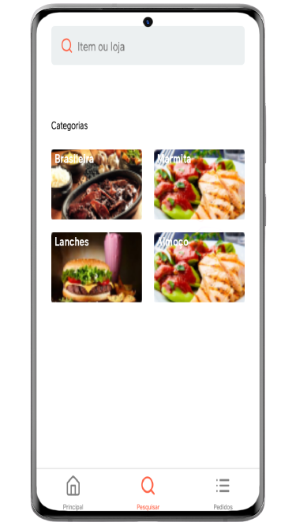
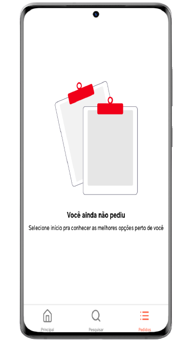

<h1 align="center">Ifood! Clone</h1>

  
  
  
  

 

  <a href="#description">Descrição</a>
  ➖
  <a href="#techs">Tecnologias</a>
  ➖
  <a href="#layout">Layout</a>
  ➖
  <a href="#help">Como usar</a>
  ➖
  <a href="#about">Autor</a>

  

## Descrição do projeto 🌠

Projeto consiste em recriar a interface do Aplicativo do Ifood!

  

## Tecnologias 💻

 

<ul>
  <li>
    <a href="https://nodejs.org/en/">NodeJS</a>
  </li>
   
  <li>
    <a href="https://yarnpkg.com/">Yarn</a>
  </li>
   
  <li>
    <a href="https://expo.io/">Expo</a>
  </li>
</ul>

  

## Layout 📲

 

<li>
  Tela Inicial
</li>
 

  

<li>
  Tela de Busca
</li>

 

  

<li>
  Tela de Pedidos
</li>

 

  

## Como usar ❓

 

1. Execute o comando: <strong>git clone</strong> https://github.com/scsSilva/app-ifood-ui-clone.git

   

2. Dentro da pasta, execute:

  <ul>
  <li>
    Usando o yarn: <strong>yarn install</strong>
  </li>
  <li>
    Usando o nodejs (npm): <strong>npm install</strong>
  </li>
  </ul>

 

3. Para finalizar, execute: <strong>expo start</strong>

  

## Autor 👨‍💻

 

Desenvolvido por: Sallys Carlos

 

Links:

<ul>

  <li>
    <a href="https://github.com/scsSilva">Github</a>
  </li>
  <li>
    <a href="https://www.linkedin.com/in/sallyscarlos">Linkedin</a>
  </li>
</ul>

